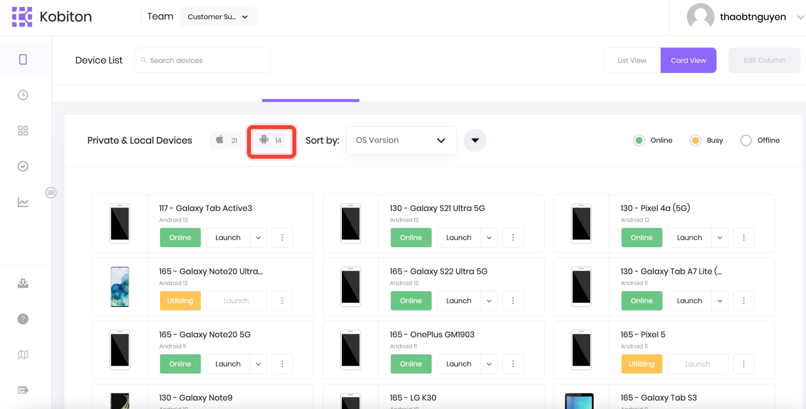
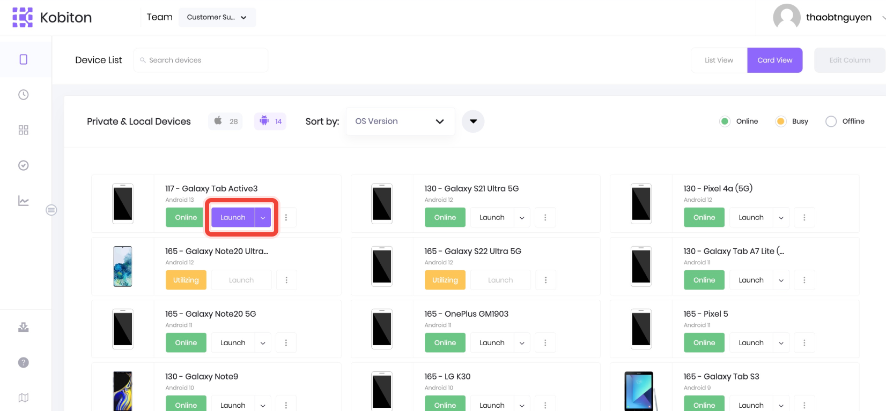
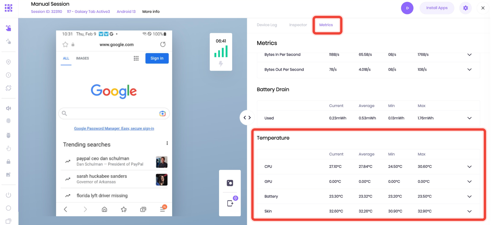
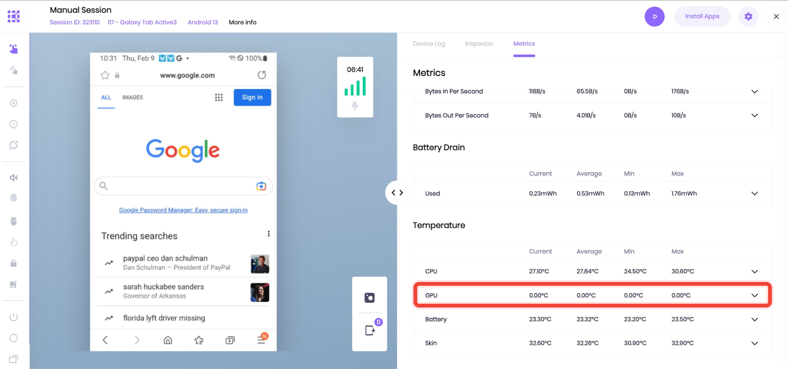
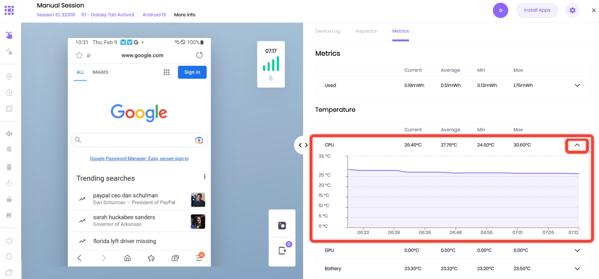
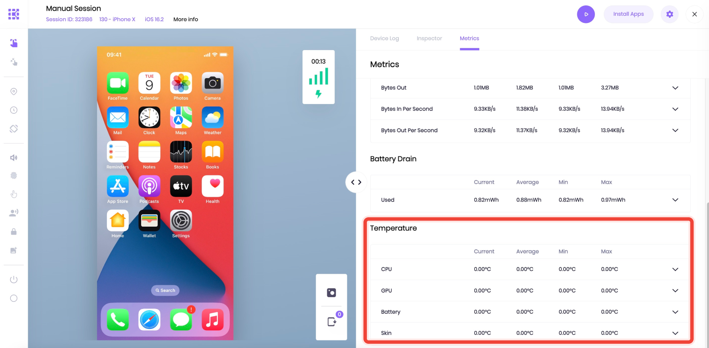

= System Metrics: Temperature
:navtitle: System Metrics: Temperature

System Metrics includes Temperature of the device at the deviceControl level. This feature helps users check the device's temperature and prevent overheating before it becomes a problems.

Users can see Temperature in the interface of ongoing Manual sessions.

NOTE: Currently,this feature is only available on Android devices and Kobiton v.2.

== Navigate to Temperature

From the *Device list*, click Android button to filter Android devices.

Click *Launch* under an Android device.

After the device has successfully launched, click on *Metrics* tab and scroll down under *Battery Drain* chart to see the *Temperature*.

== Temperature Information Description

The device's temperature is displayed in real-time (current), on average, at minimum and maximum. The unit of temperature is Celcius Degree (°C). There are four types of temperature: *CPU*, *GPU*, *Battery* and *Skin*.

[cols="2,5a"]
|===
|*Type*|*Description*

|CPU
|The temperature of the device's CPU

|GPU
|The temperature of the device’s image microprocessor

|Battery
|The temperature of the device's battery

|Skin
|The temperature of the external components (phone case ,i.e)
|===

Depending on the device OS/ model, Kobiton can retrieve data of four types of just few of four types. If there's no data, the temperature is displayed 0°C for all columns.

Click the expand arrow to see the full details of temperature.

== Limitations
This feature is unavailable for iOS devices.

For manual session launched by an iOS device, users will see 0°C for all four types.

